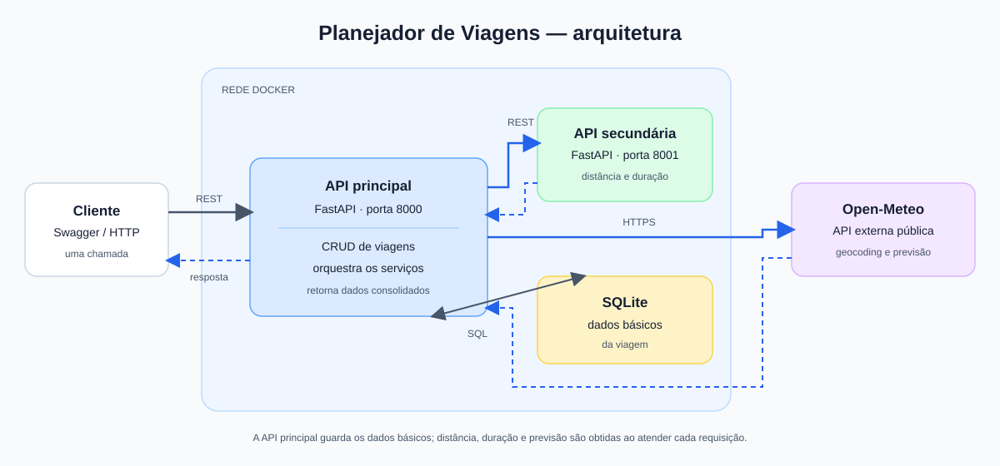

# API Secundária - Planejador de Viagens

Serviço REST em FastAPI para calcular a distância entre dois pontos e estimar a duração de uma viagem. Não acessa banco de dados nem serviços externos.

## Instalação e execução

```bash
python -m venv .venv
source .venv/bin/activate
pip install -r requirements.txt
uvicorn main:app --reload --port 8001
```

A documentação interativa fica em `http://localhost:8001/docs`.

## Executar com Docker

```bash
docker build -t planejador-viagens-secundaria .
docker network create planejador-rede
docker run -d --name planejador-api-secundaria --network planejador-rede -p 8002:8001 planejador-viagens-secundaria
```

## Rotas

- `GET /` — informações da API.
- `GET /health` — status do serviço.
- `POST /distancia` — calcula a distância em quilômetros pela fórmula de Haversine. Exemplo:

```json
{
  "origem_lat": -23.55,
  "origem_lon": -46.63,
  "destino_lat": -22.91,
  "destino_lon": -43.17
}
```

- `POST /duracao-estimada` — estima a duração em horas. Carro e ônibus usam velocidade média; avião usa velocidade de cruzeiro estimada de 850 km/h e acrescenta uma hora para operações de voo. Os meios aceitos são `carro`, `onibus` e `aviao`. Exemplo:

```json
{"distancia_km": 430, "meio_transporte": "carro"}
```

## Arquitetura

As rotas ficam separadas dos modelos e da classe que implementa os cálculos. A API principal consome os endpoints de cálculo usando o endereço Docker `http://planejador-api-secundaria:8001`; o Swagger local da secundária fica em `http://localhost:8001/docs`.


